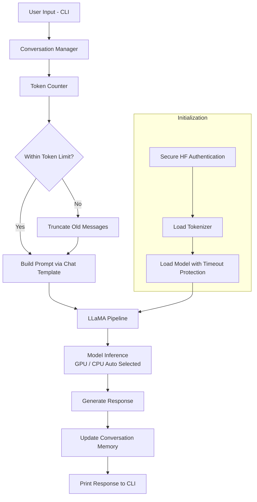

# 🤖 LLaMA Chatbot

A simple command-line chatbot built using the Hugging Face **LLaMA-2-7B Chat** model.  
The chatbot supports conversational memory, automatic context truncation, and secure authentication handling.

---

## ✨ Features

- 💬 Conversational chatbot powered by LLaMA-2-7B Chat  
- ⚙️ Automatic GPU / CPU detection  
- 🔐 Secure Hugging Face authentication (no hardcoded tokens)  
- 🧠 Token-aware memory management to prevent context overflow  
- ⏱️ Timeout-safe model loading  
- ☁️ Works in Google Colab or local environment  

---

## 🛠️ Tech Stack

- 🐍 Python  
- 🔥 PyTorch  
- 🤗 Hugging Face Transformers  
- 🤗 Hugging Face Hub  

---

## 🖥️ Hardware Requirements

### ✅ Recommended
- GPU with **16GB VRAM** for smooth performance  

### ⚠️ Minimum
- GPU with **10GB VRAM** (auto-detected in script)  

### 🐢 Fallback
- CPU mode supported but slow  

The script automatically selects GPU or CPU based on availability.

---

## 🔑 Model Access Requirement

LLaMA-2 models are gated.

You must:

1. Request access on Hugging Face  
2. Accept the Meta license  
3. Use a valid Hugging Face token  

---

## 🚀 Setup

Install dependencies:

```bash
pip install transformers torch accelerate huggingface_hub
```

Type `exit` to stop.


## Architecture


